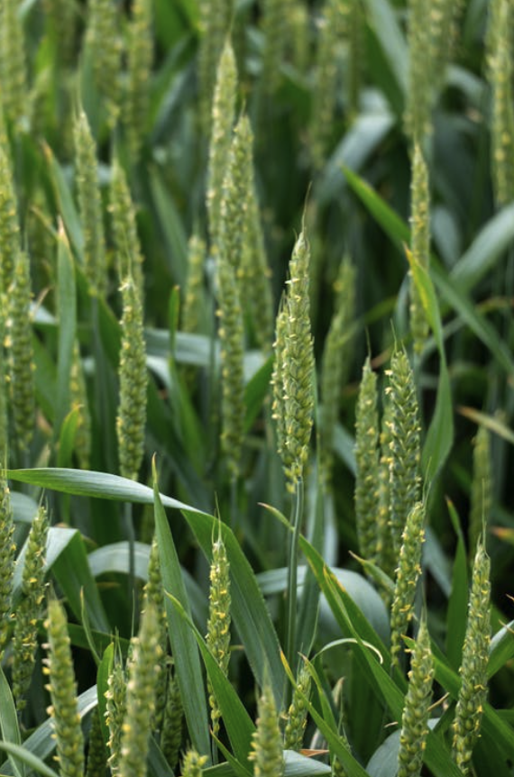

# 🌱 Calculadora Agroecológica



## ¿Qué es la Calculadora Agroecológica?

La **Calculadora Agroecológica** es una aplicación móvil desarrollada para Android que permite a comunidades, productores, investigadores y consumidores analizar y visualizar la dependencia alimentaria de su dieta o territorio. Utiliza el índice I-GDA (Índice de Globo-Dependencia Alimentaria) para cuantificar la procedencia de los alimentos y su impacto en la soberanía alimentaria y la sostenibilidad.

---

## 🌍 Importancia de la Aplicación

- **Promueve la soberanía alimentaria:** Ayuda a identificar si la dieta es local, regional, nacional o internacional.
- **Fomenta la sostenibilidad:** Visualiza el impacto de la distancia y el transporte de los alimentos.
- **Herramienta educativa:** Facilita la comprensión de conceptos clave en agroecología y consumo responsable.
- **Apoyo a la toma de decisiones:** Útil para comunidades, escuelas, ONGs y políticas públicas.

---

## 📲 ¿Cómo se usa?

1. **Ingreso de datos:** El usuario introduce los alimentos consumidos, su origen (distancia), modo de adquisición y medio de transporte.
2. **Cálculo automático:** La app calcula el índice I-GDA y clasifica la dieta según la procedencia de los alimentos.
3. **Visualización de resultados:** Se muestran tablas y gráficos con los kilómetros recorridos, el valor acumulado por alimento y la clasificación final.
4. **Interpretación:** El usuario puede analizar si su dieta es local, regional, nacional, continental o internacional, y reflexionar sobre posibles mejoras.

---

## 🛠️ Desarrollo

- **Plataforma:** Android (Kotlin, Jetpack Compose)
- **Arquitectura:** MVVM (Model-View-ViewModel)
- **Persistencia:** DataStore para almacenamiento local
- **Interfaz:** Moderna, intuitiva y adaptada a dispositivos móviles
- **Cálculo:** Implementa la fórmula científica del I-GDA, considerando distancia, modo de adquisición y transporte

---

## 📈 ¿Cómo abordar los resultados?

- **Índice I-GDA:** Un valor entre 1 y 5, donde 1 es local y 5 es internacional.
- **Tipo de alimentación:** Clasificación automática según el índice.
- **Tablas y resúmenes:** Analiza los alimentos que más contribuyen a la dependencia externa.
- **Reflexión:** Usa los resultados para promover cambios hacia una dieta más local y sostenible.

---

## 🚀 Instalación y uso

1. **Clona el repositorio:**
   ```bash
   git clone https://github.com/tuusuario/CalculadoraAgroecologica.git
   ```
2. **Abre el proyecto en Android Studio.**
3. **Ejecuta la app en un emulador o dispositivo físico.**
4. **Para compartir la app:**  
   Genera el APK desde Android Studio (`Build > Build APK(s)`) y compártelo con otros usuarios.

---

## 🖼️ Imagen de portada

La imagen de portada representa la conexión entre la producción agrícola y la alimentación, simbolizando la importancia de conocer el origen de nuestros alimentos para avanzar hacia sistemas alimentarios más justos y sostenibles.

---

## 📧 Contacto

¿Tienes dudas, sugerencias o quieres colaborar?  

---

**¡Juntos por una alimentación más local, justa y sostenible!**
